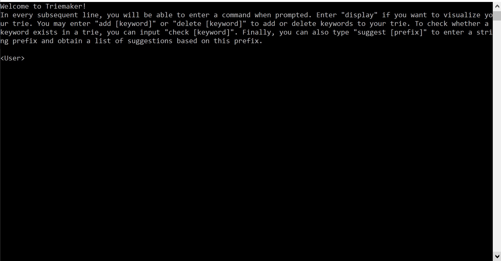

## Client Usage

Users can download `dist/client.exe` from this directory to operate on the trie. After running the executable, the CLI will open and users can play around after reading the instructions. Upon reading each valid instruction, the CLI will make requests to the server accordingly (see `README_server.md` for details on the communication to server). Below are some details on how the CLI can be used to perform certain operations on keywords.

### Add keyword

The command `add [keyword]` will add the keyword to the global trie. The `add` function accepts only one argument. Providing less or more will cause the operation to fail. The CLI will return the status of the operation, whether it passed or failed. 

### Remove keyword

The command `remove [keyword]` will remove the keyword from the global trie. The `remove` function accepts only one argument. Providing less or more will cause the operation to fail. If the keyword does not already exist in the trie, the operation will fail and the CLI will indicate this error. The CLI will return the status of the operation, whether it passed or failed. 

### Check keyword

The command `check [keyword]` will check whether the keyword exists in the global trie. The `check` function accepts only one argument. Providing less or more will cause the operation to fail. The CLI will return the status of the operation, whether it passed or failed. If the operation passed, the CLI will indicate "True" if the keyword exists ("False" otherwise).

### Suggest prefix

The command `suggest [prefix]` will return the appropriate autocomplete suggestions (keywords with this prefix) in the global trie. The `check` function accepts only one argument. Providing less or more will cause the operation to fail. The CLI will return the status of the operation. If the operation passed, the CLI will list the words from the trie that match the prefix.

### Display

The command `display` will return a primitive top-down arrangement of the trie, showing all keywords currently in the trie. The `display` function accepts no arguments. The program will ignore any arguments passed to the display function. The image below depicts an example of a trie as displayed by the CLI using the keywords (sample geographic regions as read from left to right in the display):
- Azerbaijan
- America
- Australia
- Andorra
- Armenia
- Algeria
- Burma
- Bangladesh
- Bahrain
- Barbados
- China
- Chile
- Colombia
- Cuba

Every shown node (letter) is a child of the rightmost node above and to the left of this node, where every child represents the letter ahead of the prefix behind it. Every word is represented by a path from the top line in the display to the bottom line in the display, starting from a root node and ending at a leaf node (nodes in the bottommost line). 

